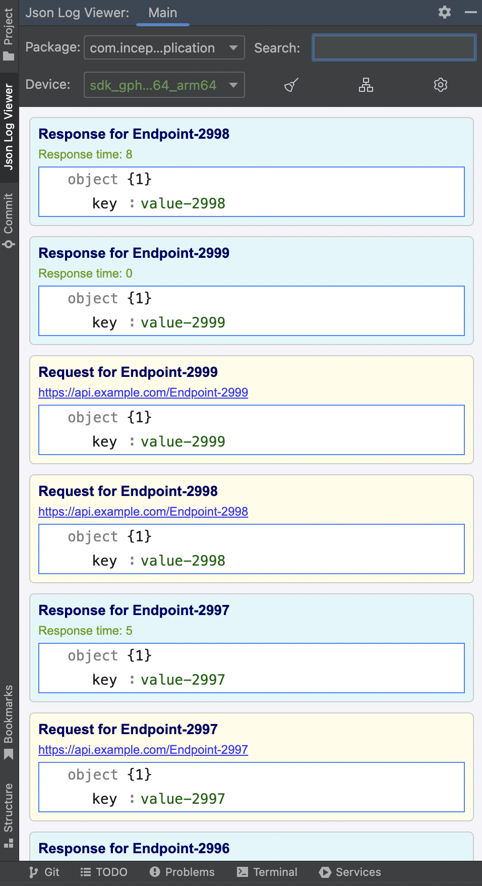
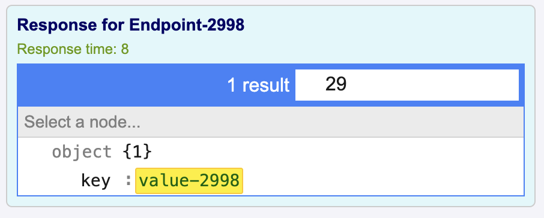
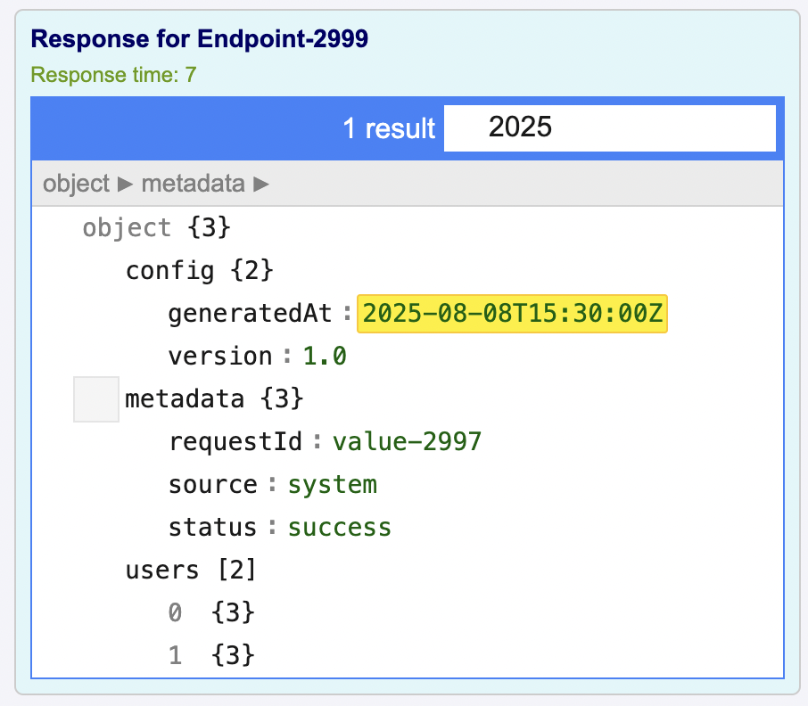
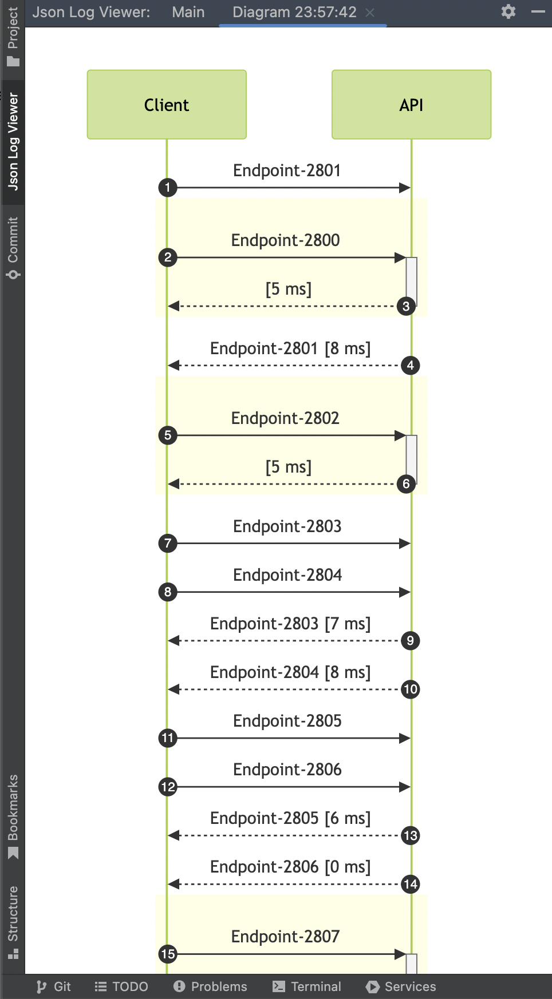
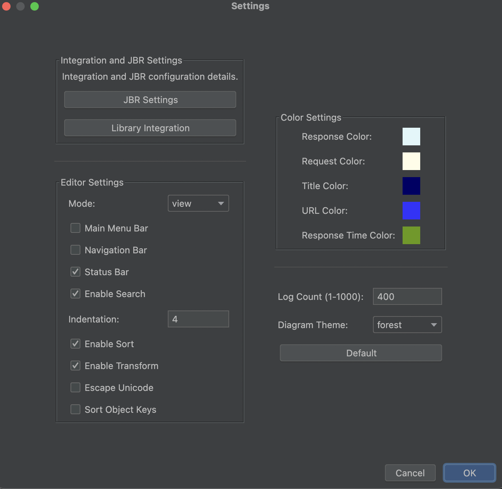

# 🔍 Json Log Viewer

Json Log Viewer is a powerful plugin for Android Studio and IntelliJ IDEA that lets you inspect, filter, and visualize your app's request and response logs in real time — directly within your IDE.

<p align="center">
  
</p>

---

## 🧠 What Does It Do?

This plugin helps you:

- 🔍 **Capture and visualize** JSON-based request/response logs from Android or server-side applications
- 📂 **Filter and search** by endpoint, device, or package name
- 📊 **View structured JSON** with syntax highlighting and collapsible trees
- 🕓 **Track response times** and sequence diagrams for API calls
- 🎨 **Customize display settings**, colors, and diagram themes
- 🔄 **Switch between View and Diagram modes** effortlessly

---

## ✨ Features

### 1. 📑 Request & Response Viewer




- Clearly separates **requests** and **responses** by color
- Highlights:
  - Endpoint name
  - Full request URL
  - Response time
- Expandable/collapsible formatted JSON viewer

---

### 2. 🔁 API Sequence Diagrams



- Visualize request/response flow between **Client** and **API**
- Millisecond-level response tracking
- Customizable diagram themes (e.g., `forest`, `neutral`, etc.)

---

### 3. ⚙️ Fully Customizable



- Choose display **mode**: JSON Viewer or Diagram
- Enable/disable:
  - Navigation bar
  - Status bar
  - Search bar
  - Unicode escape
- Set:
  - Indentation level
  - Sorting behavior
  - Custom colors for request, response, title, URL, and response time

---

## 📦 Integration Guide

To enable communication with the plugin, you need to include a lightweight SDK in your project.

There are two platform-specific libraries:

---

### 🤖 Android Studio 


#### ➕ Add the SDK

Download the Android integration library from the [`sdk/Android Studio`](https://github.com/nhrclk/jsonlogviewersdk/packages/2613172) folder and include it in your project.

#### 📤 Send Logs

```kotlin
JsonLogViewer.sendRequestLog(
    endpoint = "/auth/login",
    json = requestJson,
    url = "https://api.example.com/auth/login",
    context = context
)

JsonLogViewer.sendResponseLog(
    endpoint = "/auth/login",
    json = responseJson,
    responseTime = "512ms",
    context = context
)
```

---

### 💻 IntelliJ IDEA


#### ➕ Add the SDK

Download the Java/Kotlin integration library from the [`sdk/IntelliJ IDEA`](https://github.com/nhrclk/jsonlogviewersdk/packages/2612761) folder and include it in your JVM project.

#### 📤 Send Logs

```kotlin
JsonLogViewerCore.sendRequestLog(
    endpoint = "/api/login",
    json = requestJson,
    url = "https://api.example.com/login",
    packageName = "com.example"
)

JsonLogViewerCore.sendResponseLog(
    endpoint = "/api/login",
    json = responseJson,
    responseTime = "102ms",
    packageName = "com.example"
)
```

---

## 🔗 How It Works
The SDK communicates with the plugin using a local socket connection over localhost.
When a request or response is sent using the SDK, the plugin listens on a predefined port and visualizes the data in real-time inside your IDE.

No external network or server is used

Connection is lightweight and fast

Requires no special permissions or configuration

---

## 🔐 Security & Privacy
Json Log Viewer is designed with privacy and safety in mind:

All data is transmitted only over localhost.

No logs are sent to any external server or third party.

Suitable for debugging sensitive applications, including financial, healthcare, or enterprise-level apps.

You can safely use the plugin offline or in air-gapped environments.

---

## 🧩 Plugin Installation

This plugin is available on the **JetBrains Plugin Marketplace**:

> Go to `Settings > Plugins > Marketplace`, search for `Json Log Viewer`, install and restart your IDE.

Once installed, open the **Json Log Viewer** tab from the left tool window.

---

## 📬 Feedback

Please open an issue on [GitHub Issues](https://github.com/nhrclk/jsonlogviewersdk/issues) if you encounter problems or have feature requests.

---

## 📜 License

This plugin uses the following third-party libraries:

- Mermaid.js – MIT
- JsonEditor – Apache 2.0
- JetBrains Icons – Apache 2.0

---
